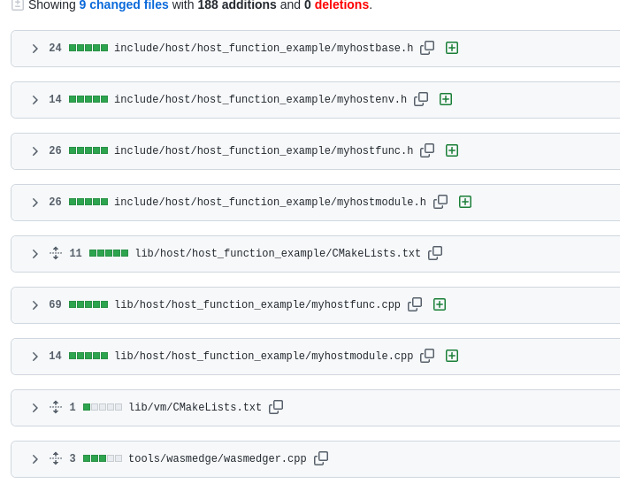

# My First Host Function
what this WasmEdge host function does is to print the content of the latest N packets from the network by using raw socket.

These are all the files changed to add the new host function.

The main idea of these files are shown as follows:
- the `myhostenv.h` file declares the member variable `sock` of `MyHost` module.
- the `myhostfunc.h` file declares the member function `PrintSocket` of `MyHost` module.
- the `myhostfunc.cpp` implements this member function.
- the `myhostmodule.cpp` registers these host function.
